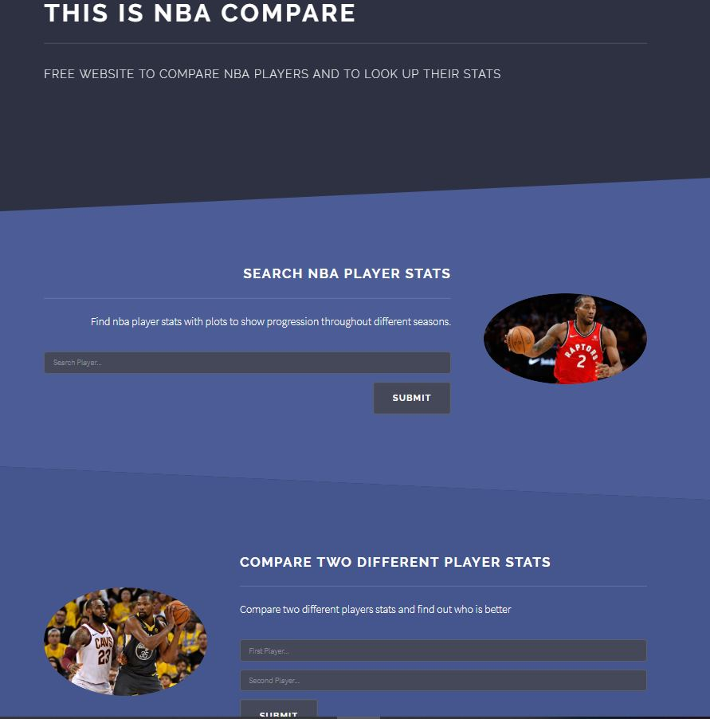
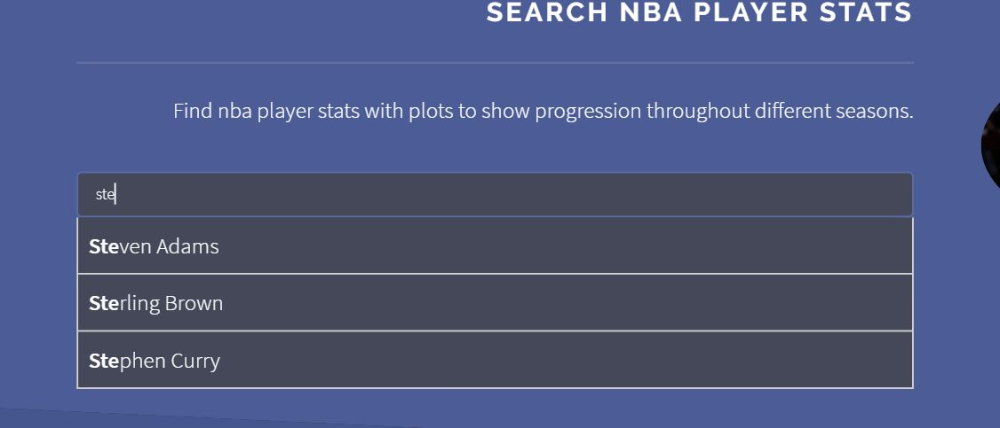
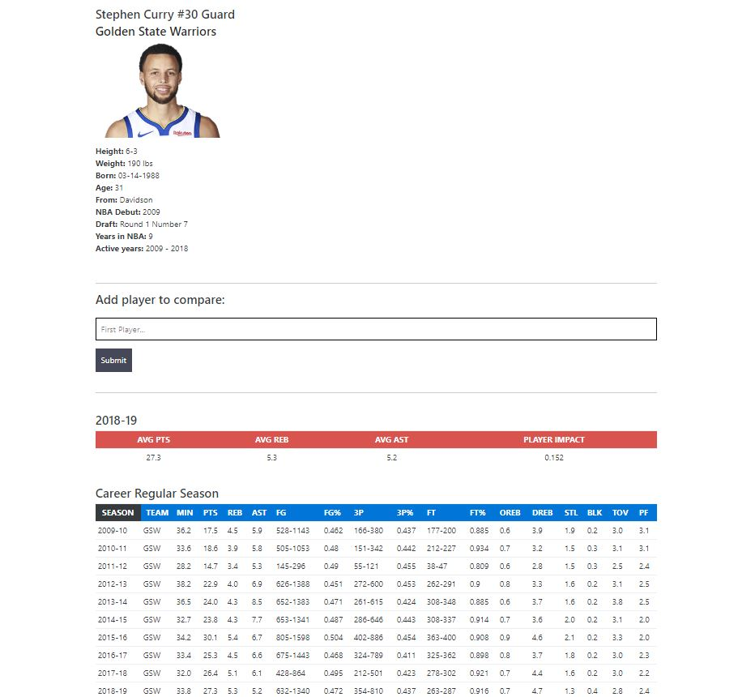
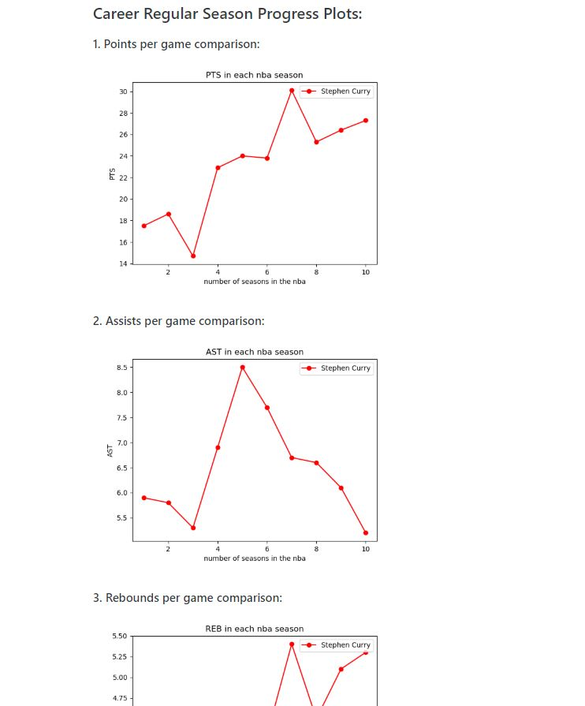
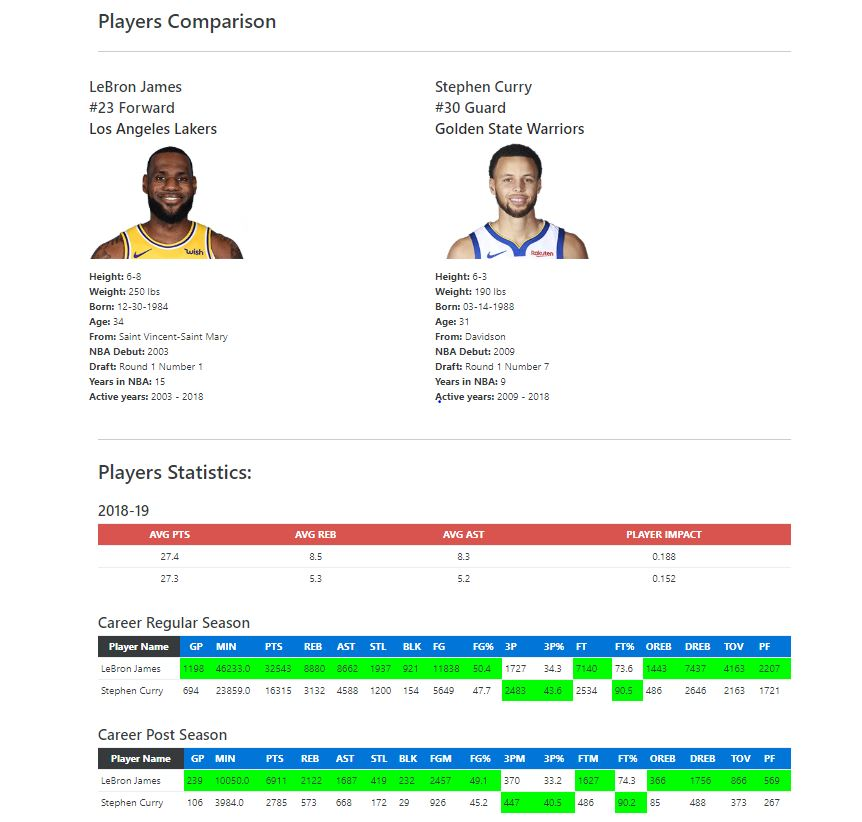
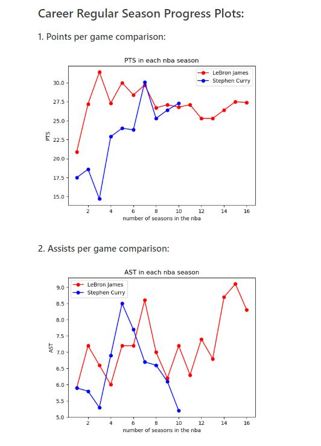

# nbacompare

Hello everyone! This is a website that I am working on that allows users to view the plots for the players statistics and to view all their statistics throughout their career. It also allows you to compare two different players with informative plots! 

The website is currently being run on the following link: https://nbacompare.appspot.com/ , however currently the API I use which is from stats.nba.com is currently temporarly blocking all traffic from websites hosted on google cloud app engine due to the fact that some websites are overusing the servers therefore only the homepage will show up, I am currently working on a fix to overcome this issue. 
However you could download the package and run it through python!

## DEMO

In this section, I will be conducting a quick demo for the website. 

### Home Page

The homepage currently have three different sections: introduction, single player search and two player searchs. 

For all the player searchboxes, I added an autocomplete function with all the nba players. 

### Single Player Search

If the user searches for one player then all his common information like height, weight, hometown etc.. will be shown first. 
Then the next section will contain the option to add a second player in order to compare all the stats. The section after that contains his overall stats for each season that he played in during his career. 

After that, the next section will contain all the plots for the player stats progress throughout the years. 

### Two Player Search

If the user searches for one player then all his common information like height, weight, hometown etc.. will be shown first. 
Then the next section will contain the option to add a second player in order to compare all the stats. The section after that contains his overall stats for each season that he played in during his career. 

After that, the next section will contain all the plots for the player stats progress throughout the years. 

## Setup

These instructions will get you a copy of the project up and running on your local machine for development and testing purposes. See deployment for notes on how to deploy the project on a live system.

### Prerequisites

What things you need to install the software and how to install them throught requirements.txt. 
0. Have `pip` installed. `sudo apt-get install pip`
1. `pip install -r requirements.txt`

### Run

After that, you could run the python command: 
1. `python main.py`

Then the website will be running on localhost port 8080. http://localhost:8080/

* **Mohammed Taha** 

## License

This project is licensed under the MIT License - see the [LICENSE.md](LICENSE.md) file for details

## Acknowledgments

* Hat tip to anyone whose code was used
* Inspiration
* etc

